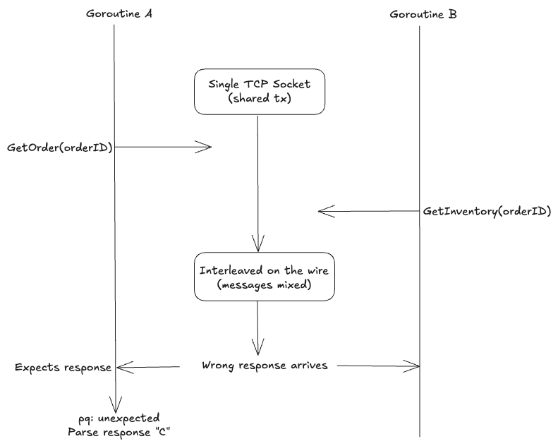

Many of us have shipped features that passed every test, only to watch them break in production. That happened to me a few months ago when I tried to speed things up with concurrency, forgetting one important constraint: database transactions aren’t thread-safe, so you can't safely share a transaction across goroutines. Let's look at this code

```go
func (s *service) ProcessOrder(ctx context.Context, orderID int) error {
    tx, err := s.db.BeginTx(ctx, nil)
    if err != nil {
        return err
    }
    defer tx.Rollback()

    var order *Order
    var inventory *Inventory

    errG, grpCtx := errgroup.WithContext(ctx)

    errG.Go(func() error {
        o, err := s.repo.GetOrder(grpCtx, tx, orderID)
        if err != nil {
	        return err
        }

        order = o
        return nil
    })

    errG.Go(func() error {
        i, err := s.repo.GetInventory(grpCtx, tx, orderID)
        if err != nil {
	        return err
        }

        inventory = i
        return nil
    })

    if err := errG.Wait(); err != nil {
        return err
    }

    if inventory.Stock < order.Quantity {
        return ErrInsufficientStock
    }

    if err := s.repo.DeductStock(ctx, tx, order.ProductID, order.Quantity); err != nil {
        return err
    }

    if err := s.repo.MarkOrderShipped(ctx, tx, orderID); err != nil {
        return err
    }

    return tx.Commit()
}
```

I spun up two goroutines to fetch the order and inventory concurrently. It seemed like the right thing to do—they were independent reads, why not? For a while, everything appeared fine: several days in staging, hundreds of orders, zero visible issues. But a few hours into production, orders stopped processing. The only clue was an error that made no sense at first:

```bash
pq: unexpected Parse response 'C'
```

And right alongside that, another symptom appeared: **stuck orders**. Users would place orders successfully, but their status never updated. The operation looked successful externally, yet the database state didn't move. It was a silent mid-transaction failure.

In Go, a `*sql.Tx` is bound to single database connection and that connection is a single TCP socket which isn't thread-safe. When two goroutines write to the same socket simultaneously, the [PostgreSQL wire protocol](https://www.postgresql.org/docs/current/protocol.html) messages get interleaved and the stream becomes corrupted.
With two goroutines racing, the protocol message sequences overlap and goroutine A can end up receiving the parse response intended for goroutine B, so the driver loses track of which response belongs to which query, eventually triggering the error we saw above.



Why didn't it fail in the staging? That's the nature of Heisenbugs, they seem to disappear when you look for them. Race conditions are probabilistic, this one was there the whole time. Staging had low traffic, so the two goroutines often finished before they could overlap. And if you're wondering: no, `go test -race` won't catch this. The race detector instruments Go memory, not TCP socket I/O. The corruption happened at the wire level, outside Go's visibility.

The fix was simple: sequential queries, no shared transaction across goroutines.

```go
func (s *service) ProcessOrder(ctx context.Context, orderID int) error {
    tx, err := s.db.BeginTx(ctx, nil)
    if err != nil {
        return err
    }
    defer tx.Rollback()

    order, err := s.repo.GetOrder(ctx, tx, orderID)
    if err != nil {
        return err
    }

    inventory, err := s.repo.GetInventory(ctx, tx, orderID)
    if err != nil {
        return err
    }

    if inventory.Stock < order.Quantity {
        return ErrInsufficientStock
    }

    if err := s.repo.DeductStock(ctx, tx, order.ProductID, order.Quantity); err != nil {
        return err
    }

    if err := s.repo.MarkOrderShipped(ctx, tx, orderID); err != nil {
        return err
    }

    return tx.Commit()
}
```

If you need concurrent database work, do it before starting the transaction, or use separate connections. But once you call BeginTx, that connection belongs to one goroutine until Commit or Rollback.
